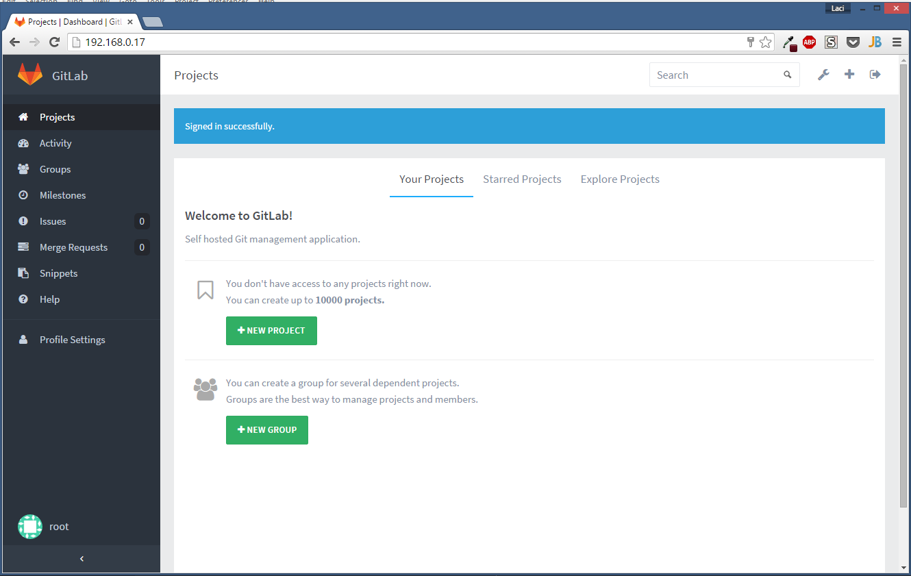

# Install GitLab with SaltStack

This repository contains the saltstack configuration files for our classroom project at University of Szeged. We'll propose two methods below to install GitLab. GitLab is a web-based Git repository manager with wiki and issue tracking features similar to GitHub. Unlike GitHub you can use GitLab on third-party servers.

The first method is to install GitLab in a VirtualBox VM. You can run VirtualBox on several platforms. VirtualBox is a Type-2 hypervisor that runs on a conventional operating system just as other programs do.

The second method is to install GitLab in a SaltStack VM. OpenStack software controls large pools of compute, storage, and networking resources throughout a datacenter, managed through a dashboard or via the OpenStack API. OpenStack works with popular enterprise and open source technologies making it ideal for heterogeneous infrastructure.

We'll create the Virtual Machines using Vagrant.

## 1. Install GitLab locally in a VirtualBox VM

### 1.1. Prerequisites
 - [VirtualBox](https://www.virtualbox.org/)
 - [Vagrant](https://www.vagrantup.com/)

### 1.2. Virtual Machine configuration

Vagrant will create the Virtual Machine automatically based on the [Vagrantfile](GitLab/Vagrantfile) placed in the GitLab directory.

You can customize the name that appears in the VirtualBox GUI by setting the vb.name property. For memory and CPU settings you can set the vb.cpus and vb.memory properties. The config.vm.network configures networks on the machine. Currently it is set to bridge mode with a static IP address.

```ruby
config.vm.provider :virtualbox do |vb|
  vb.name = "GitLab"
  vb.memory = 2048
  vb.cpus = 8
end

config.vm.network "public_network", ip: "192.168.0.17", bridge: "Realtek PCIe GBE Family Controller"
```

### 1.3. GitLab configuration
You can set some variables in the [SaltStack configuration file](GitLab/saltstack/pillar/config.sls) placed in the GitLab directory.

Below you can see an example configuration:

```yaml
config:
  lookup:
    db_key_base:
      production: FcC.Pqm3g~.=vx?dEe,>YcU'.(W@DX3[QX3/35"c
      development: development
      test: test
    nginx:
      fqdn: gitlab-test.dev
    gitlab:
      root_password: valami!biztonsagos2015
```

### 1.4. GitLab installation
Execute the following commands to create a Virtual Machine. After the creation Vagrant'll run the provisioning process.

```sh
:~$ cd [git-repo]/GitLab
:~$ vagrant up --provider=virtualbox
```

After this command you'll have a VM that runs GitLab. The provisioning process is based on the [official installation guide](https://github.com/gitlabhq/gitlabhq/blob/master/doc/install/installation.md).

### 1.5. Running

Visit the IP address set in the [Vagrantfile](GitLab/Vagrantfile) or the FQDN set in the [SaltStack configuration file](GitLab/saltstack/pillar/config.sls) in your web browser for your first GitLab login:

```sh
http://192.168.0.17
http://gitlab-test.dev
```
NOTE: You have to map the hostname to the IP address.

The setup has created a default admin account for you:

```
Username: root
Password: set in config.sls
```
### 1.6. Screenshot


## 2. Install GitLab in an OpenStack VM

### 2.1. Prerequisites
 - [VirtualBox](https://www.virtualbox.org/)
 - [Vagrant](https://www.vagrantup.com/)
 - [Salty Vagrant Grains](https://github.com/ahmadsherif/salty-vagrant-grains)
 - [Vagrant OpenStack Provider](https://github.com/cloudbau/vagrant-openstack-plugin)

### 2.2. OpenStack configuration

You can set the needed OpenStack configuration variables in the [minion file](OpenStack/saltstack/etc/minion).

Example OpenStack configuration:
```yaml
  admin_pw: hop     # Administrator password
  db_pw: hop        # Database password
  rabbit_pw: hop    # RabbitMQ password
  svc_pw: hop       # Service password
  floating_range: 172.24.4.0/24     # The externally accessible network address range
  token: a682f596-76f3-11e3-b3b2-e716f9080d50   # Authentication token
```

You can find the Virtual Machine's configuration in the [Vagrantfile](OpenStack/Vagrantfile).

Example Vagrantfile:
```ruby
  # OpenStack will listen on this IP address
  config.vm.network :private_network, ip: "192.168.27.100"
  # Az itt megadott ip cimnek a lentebbi 'floating_range' tartomanyba kell esnie!
  config.vm.network :private_network, ip: "172.24.4.225", :netmask => "255.255.255.0", :auto_config => false

  config.vm.provider :virtualbox do |vb|
    vb.memory = 8196
    vb.cpus = 4
  # ...

  config.vm.provision :salt do |salt|
    # ...
    salt.grains({
      # Ebben a tartomanyban lesznek elerhetoek az OpenStack-ben letrehozott virtualis gepeink
      floating_range: '172.24.4.0/24'
    # ...
```

### 2.3. Install OpenStack locally in a VirtualBox VM

**You have to install this plugin to run the script:**
```sh
vagrant plugin install salty-vagrant-grains
```

Execute the following commands to install OpenStack:

```sh
:~$ cd [git-repo]/OpenStack
:~$ vagrant up --provider=virtualbox
```

After the execution of the commands above you'll have a VirtualBox VM called 'OpenStack'. After the first boot Vagrant will start the provisioning process which will install OpenStack using SaltStack.

The provisioning is created with the help of the [DevStack script](http://docs.openstack.org/developer/devstack).

### 2.4. Install GitLab in an OpenStack VM

WIP


### 2.5. Running

Visit the IP address set in the Vagrantfile or the FQDN in your web browser:

```sh
http://192.168.27.100/dashboard
```
Login details

```sh
Username: admin / demo
Password: set in config.sls
```

### 3. Appendix

**Created by:**
 - Laszlo DOBO (GitLab directory)
 - Andras MAROY (OpenStack directory)

**Sources:**
 - [Vagrant DOCS](https://docs.vagrantup.com/v2/)
 - [SaltStack Docs](https://docs.saltstack.com/en/latest/ref/states/all/index.html)
 - [OpenStack Wiki](https://wiki.openstack.org/wiki/Main_Page)
 - [Salt formula](https://github.com/saltstack-formulas/salt-formula)
 - [Brightbox PPA - ruby2.1](https://www.brightbox.com/blog/2014/01/09/ruby-2-1-ubuntu-packages/)
 - [LXC PPA - golang1.5.1](https://launchpad.net/~ubuntu-lxc/+archive/ubuntu/lxd-stable)
 - [ubuntu/trusty64 vagrant box](https://atlas.hashicorp.com/ubuntu/boxes/trusty64)
